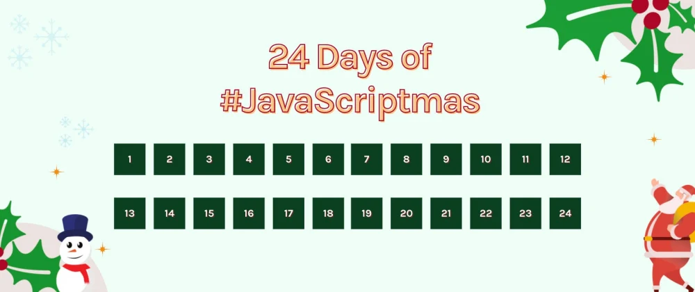

# My #JavaScriptmas Solutions!

  

في نهاية العام الماضي تعرّفت على موقع [سكريمبا](https://scrimba.com) التعليمي و هي منصّة تعليمية مختلفة في طريقة توصيلها للمعلومة حيث التعليم على سكريمبا تفاعلي بشكل كبير مما يساعد على تعلّم مجالات الويب بكفاءة و في رأيي هي منصة مميزة لكل الباحثين عن تعلّم الفرونت إند.

من المزايا الأخرى للتعلّم التفاعلي على سكريمبا هو اهتمامها بتقديم مسابقات دورية و تحديّات بين المتعلّمين.. حيث يتشاركون التحدّي و يحلّون المسائل بشكل دوري مما يحسّن من مستواهُم..
و بما إني عرفت سكريمبا مؤخرًا فقد شاركت في تحدّيهم الأخير فقط.. تحدّي جافاسكريبتماس. جاء التحدّي في نهاية العام و بدلًا من قول "ميري كريسماس" كانوا يخبرونا بأن نقول "ميري جافاسكريبتماس"! يا إلهي، المبرمجون و نِكاتِهم 😪.

جافاسكريبتماس هو تحدّي في استخدام لغة الجافاسكريبت بطريقة صحيحة لحل مشاكل برمجية بسيطة.. على مدار 24 يومًا يرسل لك الموقع مسألة يوميّة على بريدك الإلكتروني لتحاول حلّها و في اليوم التاني يخبرك عن أحد الحلول الممكنة لها.. ما جعل التجربة مختلفة هو وجود سيرفر ديسكورد خاص بسكريمبا يحتوى على أفضل طلبة الفرونت إند المستعدّين لمساعدتك و الراغبين حقًا في التعلّم مثلك.

هنا أشارك تجاربي في تحدّي جافاسكريبتماس لعام 2020 لأرشفتها و لتذكير نفسي بأن البقاء داخل منطقة الراحة غير مريح، كلانا يا صديقي نحتاج لبعض التحدّي.

Day 1. [Candies](day1-candies)    
Day 2. [Deposit Profit](day2-depositProfit)  
Day 3. [Chunky Monkey](day3-chunkyMonkey)  
Day 4. [Century From Year](day4-centuryFromYear)  
Day 5. [Reverse A String](day5-reverseAString)  
Day 6. [Sort By Length](day6-sortByLength)  
Day 7. [Count Vowel Consonant](day7-countVowelConsonant)  
Day 8. [Rolling Dice](day8-rollingDice)  
Day 9. [Sum Odd Fibonacci Numbers](day9-sumOddFibonacciNumbers)  
Day 10. [Adjacent Elements Product](day10-adjacentElementsProduct)  
Day 11. [Avoid Obstacles](day11-avoidObstacles)  
Day 12. [Valid Time](day12-validTime)  
Day 13. [Extract Each Kth](day13-extractEachKth)  
Day 14. [Maximal Adjacent Difference](day14-arrayMaximalAdjacentDifference)  
Day 15. [JavaScript Carousel](day15-javaScriptCarousel)  
Day 16. [Insert Dashes](day16-insertDashes)  
Day 17. [Different Symbols Naive](day17-differentSymbolsNaive)  
Day 18. [Array Previous Less](day18-arrayPreviousLess)  
Day 19. [Alphabet Subsequence](day19-alphabetSubsequence)  
Day 20. [Domain Type](day20-domainType)  
Day 21. [Sum of Two](day21-sumOfTwo)  
Day 22. [Extract Matrix Column](day22-extractMatrixColumn)  
Day 23. [Social Media Input](day23-socialMediaInput)  
Day 24. [Test Your Agility](day24-testYourAgility)  

لتذكير نفسي.. أنهيت التحدّيات في وقتها المحدد و تم إعلان حلّى ليوم 23 ديسمبر كواحد من أكثر الحلول الإبداعية في جافاسكريبتماس 2020.. و هذا أمرٌ أحببتُه ❤